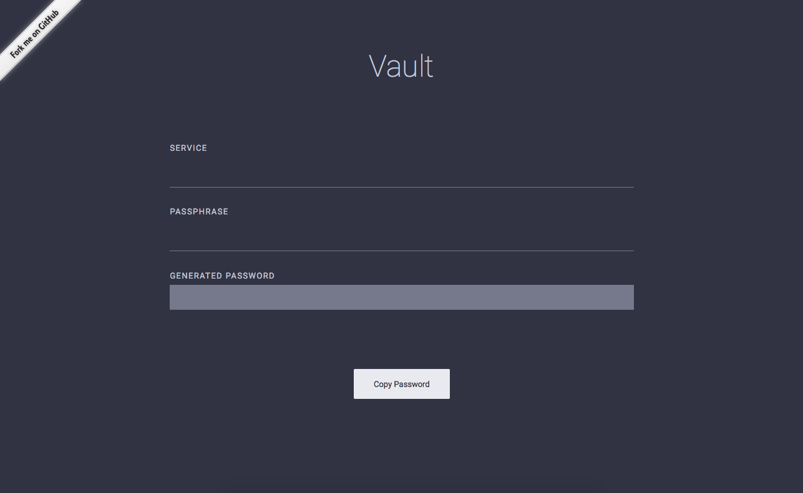

Vault
=====

An app that generates unique passwords for different accounts using one master password and service name. Inspired by https://getvau.lt/ this app is mobile friendly and keeps it simple.

Link
===
https://joanithagomez.github.io/projects/vault/

Used
====

* React.js
* create-react-app
* Sketch

Author
======
Joanitha Christle Gomez

License
=======
This project is licensed under the MIT License - see the [LICENSE](LICENSE) file for details

Acknowledgements
==============

* https://getvau.lt/
* https://github.com/facebook/create-react-app

